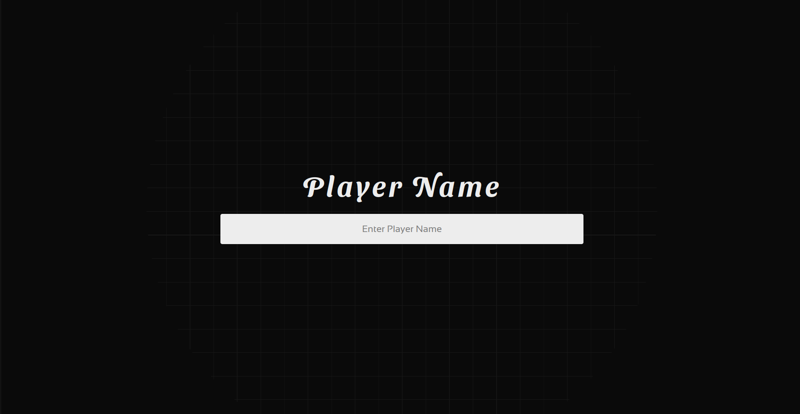
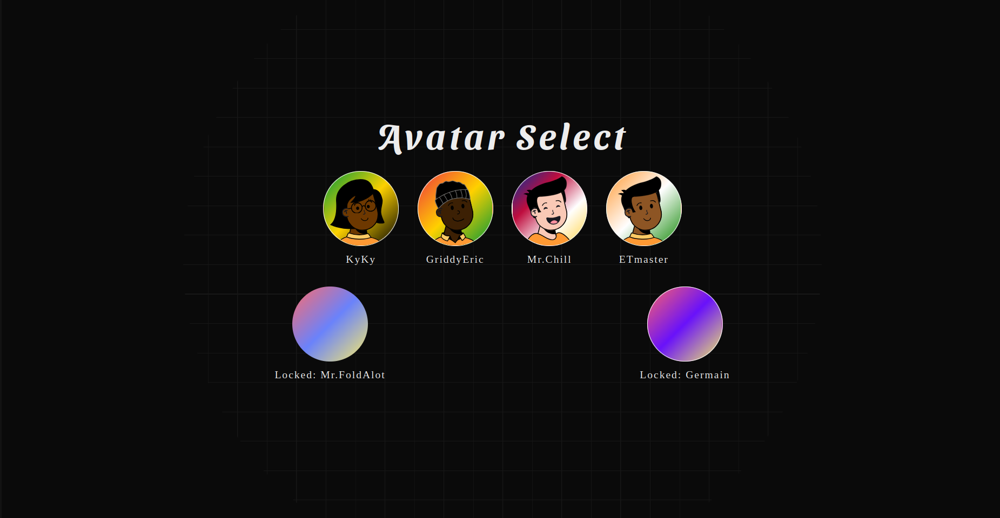

# Real-Time Multiplayer Tier List Document Editor

<div style="text-align: center;">
  <table width="100%" height="500px" style="margin: 0 auto;">
    <tr>
      <td style="vertical-align: top; width: 40%; height: "100%"; text-align: center;">
        <br/>
        
      </td>
        <td style="vertical-align: top; width: 60%; height: "100%"; padding-left: 20px; text-align: center;">
        
        </td>
    </tr>
  </table>
</div>


Modern real-time collaborative web application that allows multiple users to edit a tier lists document simultaneously. Built with a modern tech stack including **Next.js** for the frontend and **.NET SignalR** for real-time backend communication, it mimics the live-editing capabilities of tools like Google Docs — but tailored for tier list enthusiasts and communities.

---

## ⚙️ Features

- 🧑‍🤝‍🧑 Real-time multi-user editing
- ✏️ Drag-and-drop interface for easy tier management
- 🔒 User session handling without login
- 📶 Real time data transfer using WebSocket-based backend (.NET SignalR)
- 🛡️ Conflict resolution logic for simultaneous edits

---

## 🧠 How It Works

1. Users open the tier list editor in their browser.
2. Each user is assigned a temporary session.
3. Edits are instantly broadcast to all connected users via **SignalR**.
4. The app maintains and updates the shared document state live.

---

## 🐳 Local Setup Using Docker

You can run the full app locally using Docker. This setup includes both frontend and backend services. Run the following command from the root project folder and go to app URL.

### 1. Build the Docker Images

```bash
docker compose up
```

### 2. Access application
```bash
http://localhost:3000/
```
